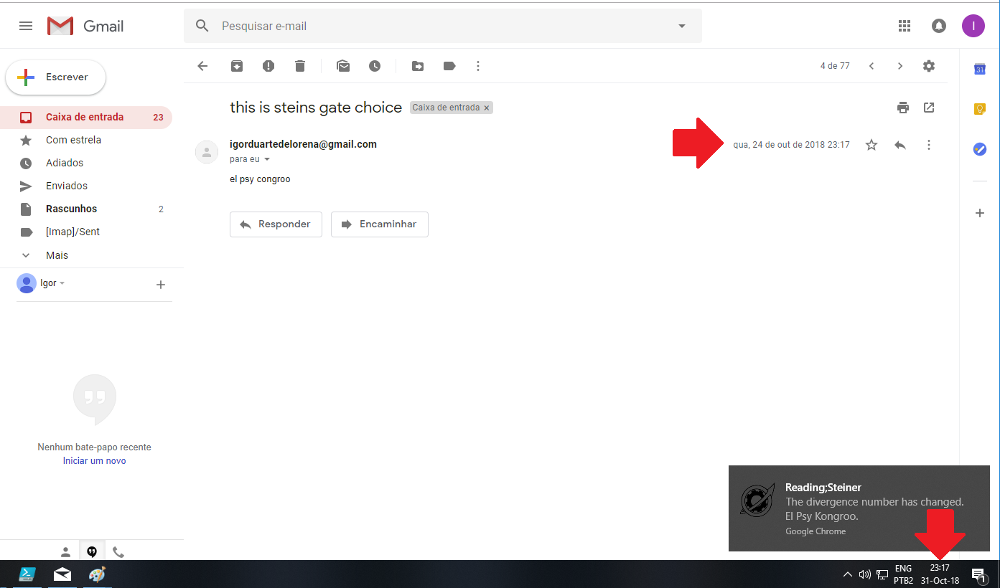

# Projeto Reading;Steiner

Baseado no Gadget #8 da série "Steins;Gate", o projeto Reading;Steiner visa mandar emails para o passado!
**Muahahaha!**

## Como funciona ?
O Reading;Steiner é uma extensão do navegador Google Chrome que altera a data de emails enviados a partir de um servidor PHP exterior.
Se a extensão estiver instalada, ao abrir um desses emails a data será alterada para 7 dias atrás.

## Requisitos
É necessário ter instalado o navegador Google Chrome, possuir uma conta no g-mail e ficar ciente de que as datas somente são exibidas no idioma PT-BR. Para a versão EN-US, [clique aqui.](https://github.com/igorgum/readingsteinerproject/)

## Instalação
Para instalar a extensão, siga estes passos:
* Faça o download da pasta Extensão, presente na pasta Projeto deste repositório
* Acesse a [página de extensões](chrome://extensions/) no navegador do Google Chrome
* Ative o "Modo do desenvolvedor" no canto superior direito
* Arraste a pasta "Extensão" e solte na página de extensões
* Acesse [esta página](https://myaccount.google.com/lesssecureapps?pli=1) e ative a permissão

## Utilização
Para mandar um email, utilize um dos dois modos:

**_Via HTML (Desktop)_**
* Acesse [esta página](https://igorgum.github.io/projetoreadingsteiner/index.html)

**_Via Apk (Android)_**
~~Jui infelizmente está tendo problemas com a Organização e fará upload do apk em breve em [seu git](https://github.com/Aldebaram/)~~
Jui conseguiu se desvencilhar da Organização:

* Acesse [este repositório](https://github.com/Aldebaram/gadget_9) de meu amigo Supah Hacka Jui Cezar

## Imagens

